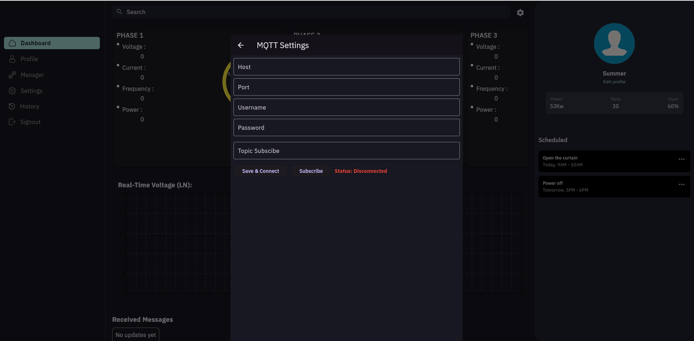
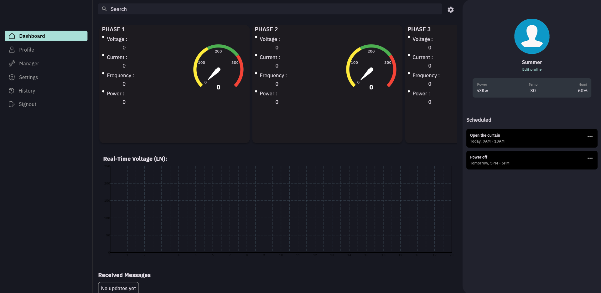

# 🚀 Thiết bị Giám sát hệ đồng hồ điện 3 phase (1 phase) bẳng giao thức mqtt và modbus rtu

---

## 📖 Mô tả dự án
Dự án này phát triển một thiết bị giám sát đồng hồ điện 3 phase (hoặc 1 phase), sử dụng giao thức Modbus RTU để lấy dữ liệu từ công tơ điện và MQTT để truyền dữ liệu lên server. Hệ thống sử dụng vi điều khiển STM32 kết hợp với module SIM7600 để gửi dữ liệu qua 4G LTE đến một nền tảng IoT (MQTT broker hoặc cloud server).

Thiết bị có thể được ứng dụng trong giám sát tiêu thụ điện từ xa, cảnh báo khi có bất thường và tối ưu hóa quản lý điện năng.

### 🎯 **Tính năng chính**
✅ Đọc dữ liệu từ đồng hồ điện qua Modbus RTU (dòng điện, điện áp, công suất, hệ số công suất, tần số, v.v.)   
✅ Gửi dữ liệu lên server qua MQTT sử dụng SIM7600 (4G LTE)   
✅ Lưu trữ dữ liệu tạm thời khi mất kết nối và tự động gửi lại khi có mạng   
✅ Cảnh báo tức thời khi có bất thường (quá tải, mất phase, điện áp thấp/cao)   
✅ Đóng cắt contactor hoặc relay trực tiếp trên thiết bị hoặc trên dashboard   
✅ Giao diện giám sát real-time trên dashboard IoT   
✅ sử dụng màn hình lcd 2004 qua giao thức I2c để quan sát chế độ hoạt động của thiết bị   
✅ Nâng cấp firmware từ xa (OTA) qua MQTT   

---
## 🏗 Cấu trúc dự án
📂 STM32_SIM76-00 ┣ 📂 CABIN # Code nhúng cho STM32/ESP32 ┣ 📂 HARDWARE # Thiết kế mạch cho thiết bị (Altium) ┣ 📂 SOFTWARE # Code ứng dụng sử dụng fultter 
## 🔧 Công nghệ sử dụng
| Công nghệ  | Mô tả |
|------------|----------------------------|
| **STM32**  | Vi điều khiển chính |
| **RTOS**  | multithread  |
| **MQTT**  | Giao tiếp giữa thiết bị & server |
| **flutter**  | Xây dựng giao diện cho ứng dụng |  

---
## 🔧 Phần Cứng & Kết Nối

### 1️⃣ **Danh Sách Linh Kiện**
| **Linh Kiện** | **Chức Năng** |
|--------------|--------------|
| **STM32F407 / STM32F103** | Vi điều khiển chính |
| **SIM7600E** | Gửi dữ liệu MQTT qua 4G LTE |
| **ISO3082** | Ic giao tiếp cách ly với công tơ điện qua Modbus RTU |
| **Nguồn 12V -> 5V,3v3,... DC-DC** | Cấp nguồn cho thiết bị |
| **USB** | Cấp nguồn cho thiết bị hoặc giao tiếp với máy tính để debug hoặc control |  

### 1️⃣ **Phần mềm**
✅ Phần mềm được viết bằng flutter có thể biên dịch và chạy trên nhiều nền tảng khác nhau ứng dụng đọc dữ liệu trực tiếp trên mqtt broker và hiển thị trên ứng dụng qua các số hoặc biểu đồ.  
Có thể điều chỉnh các thông số của server hoặc topic trự tiếp trên ứng dụng.  

