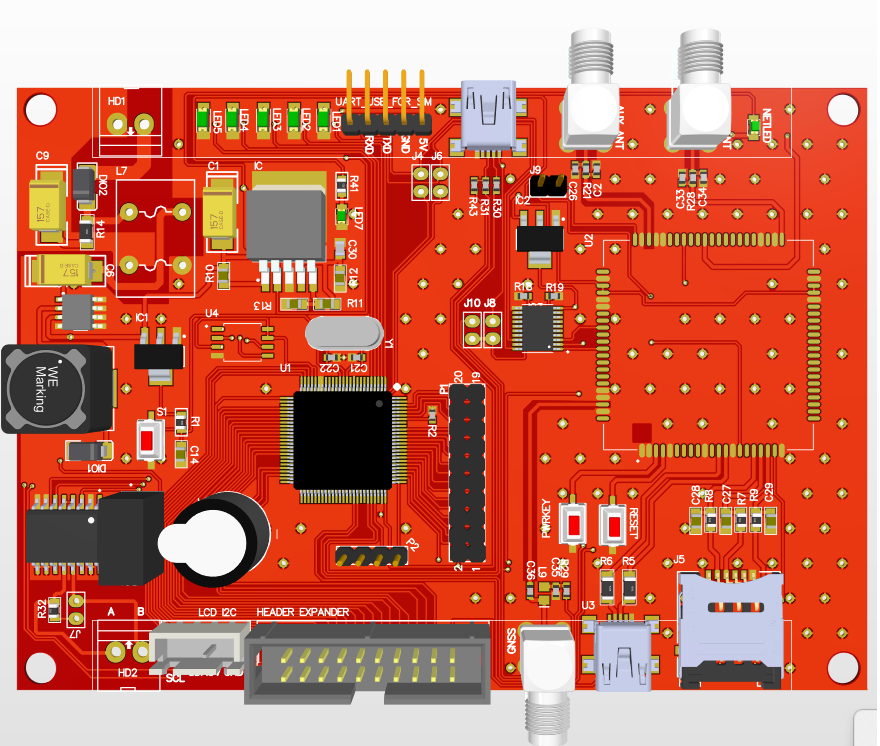
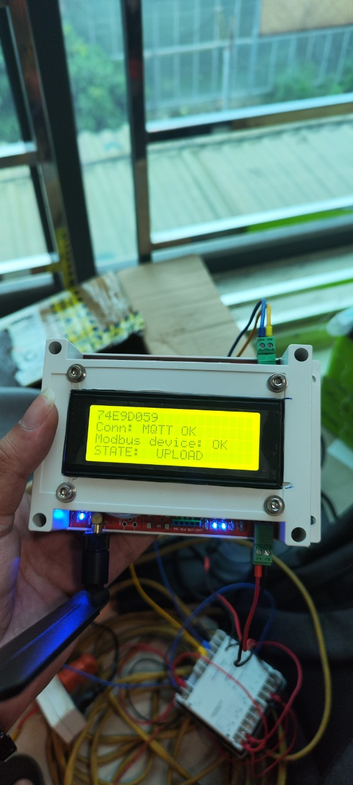
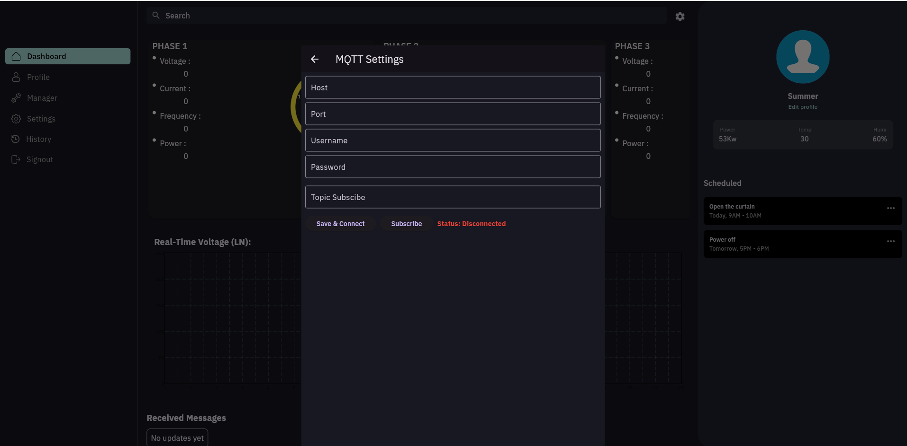
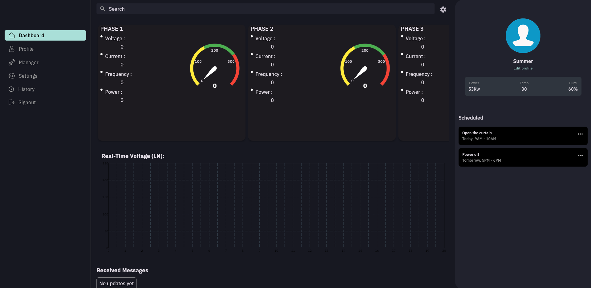

# 🚀 3-Phase (1-Phase) Power Meter Monitoring System using MQTT and Modbus RTU


---

## 📖 Project Description
This project develops a monitoring device for 3-phase (or single-phase) power meters, using Modbus RTU protocol to retrieve data from electrical meters and MQTT to transmit data to servers. The system uses STM32 microcontroller combined with SIM7600 module to send data via 4G LTE to an IoT platform (MQTT broker or cloud server).

The device can be applied in remote power consumption monitoring, alerting when anomalies occur, and optimizing electrical energy management.

### 🎯 **Key Features**
✅ Read data from power meters via Modbus RTU (current, voltage, power, power factor, frequency, etc.)   
✅ Send data to server via MQTT using SIM7600 (4G LTE)   
✅ Temporary data storage when connection is lost and automatic resend when network is available   
✅ Instant alerts when anomalies occur (overload, phase loss, low/high voltage)   
✅ Direct contactor or relay control on device or via dashboard   
✅ Real-time monitoring interface on IoT dashboard   
✅ Use LCD 2004 display via I2C protocol to observe device operating mode   
✅ Remote firmware upgrade (OTA) via MQTT   

---

## 🏗 Project Structure
```
📂 STM32_SIM7600
┣ 📂 CABIN      # Embedded code for STM32/ESP32
┣ 📂 HARDWARE   # Circuit design for device (Altium)
┣ 📂 SOFTWARE   # Application code using Flutter
```

## 🔧 Technologies Used
| Technology | Description |
|------------|----------------------------|
| **STM32**  | Main microcontroller |
| **RTOS**   | Multithreading |
| **MQTT**   | Communication between device & server |
| **Flutter** | Building application interface |

---

## 🔧 Hardware & Connections

### 1️⃣ **Component List**
| **Component** | **Function** |
|---------------|--------------|
| **STM32F407 / STM32F103** | Main microcontroller |
| **SIM7600E** | Send MQTT data via 4G LTE |
| **ISO3082** | Isolated interface IC for power meter communication via Modbus RTU |
| **12V → 5V, 3.3V, ... DC-DC Power Supply** | Power supply for device |
| **USB** | Power supply for device or communication with computer for debug/control |




### 2️⃣ **Software**
✅ Software written in Flutter can be compiled and run on multiple different platforms. Application reads data directly from MQTT broker and displays on application via numbers or charts.  
Can adjust server parameters or topics directly on the application.




---

## ⚡ Technical Specifications

### Hardware Features
- **Microcontroller**: STM32F407 (ARM Cortex-M4) or STM32F103 (ARM Cortex-M3)
- **Communication**: 4G LTE via SIM7600E module
- **Display**: LCD 2004 with I2C interface
- **Isolation**: Galvanic isolation for Modbus RTU communication
- **Power Supply**: Wide input range DC-DC converters
- **Interfaces**: USB, UART, I2C, SPI

### Software Architecture
- **Real-Time OS**: FreeRTOS for multitasking
- **Communication Protocols**: Modbus RTU, MQTT 3.1.1, TCP/IP
- **Mobile App**: Cross-platform Flutter application
- **Data Format**: JSON for MQTT messaging
- **Security**: TLS encryption for MQTT communication

### Monitoring Parameters
- **Voltage**: 3-phase voltage measurements (V)
- **Current**: 3-phase current measurements (A)
- **Power**: Active, reactive, and apparent power (kW, kVAR, kVA)
- **Power Factor**: System power factor
- **Frequency**: Line frequency (Hz)
- **Energy**: Accumulated energy consumption (kWh)

---

## 🚀 Installation & Setup

### Hardware Setup
1. Connect power meters to device via Modbus RTU (RS485)
2. Insert SIM card into SIM7600E module
3. Connect power supply (12V DC input)
4. Connect LCD display via I2C interface

### Software Configuration
1. Configure MQTT broker settings
2. Set up Modbus device addresses and parameters
3. Install mobile application
4. Configure data publishing intervals and alarm thresholds

### Mobile Application Features
- Real-time data visualization
- Historical data charts and trends
- Alarm configuration and notifications
- Remote device configuration
- Export data reports

---

## 📊 Applications

### Industrial Applications
- **Factory energy monitoring**: Track power consumption across production lines
- **Building management**: Monitor electrical systems in commercial buildings
- **Data centers**: Power usage effectiveness (PUE) monitoring
- **Renewable energy**: Solar and wind power generation monitoring

### Smart Grid Integration
- **Demand response**: Automated load management based on grid conditions
- **Peak shaving**: Reduce electricity costs during peak demand periods
- **Power quality monitoring**: Detect voltage sags, harmonics, and interruptions
- **Energy trading**: Accurate measurement for energy market transactions

---

## 🔒 Security Features

### Device Security
- **Secure boot**: Verified firmware loading
- **Hardware encryption**: Secure key storage
- **Access control**: User authentication and authorization
- **Firmware integrity**: Digital signature verification

### Communication Security
- **TLS/SSL encryption**: Secure MQTT communication
- **Certificate management**: Device and server authentication
- **VPN support**: Virtual private network connectivity
- **Data integrity**: Message authentication codes

---

## 📈 Performance Metrics

### System Performance
- **Data sampling rate**: Up to 1 sample per second per parameter
- **Communication latency**: <3 seconds from meter to cloud
- **System uptime**: >99.5% availability
- **Power consumption**: <2W average operation
- **Operating temperature**: -20°C to +70°C
- **Humidity**: 5% to 95% non-condensing

### Scalability
- **Multi-device support**: Monitor up to 32 meters per gateway
- **Cloud integration**: Compatible with major IoT platforms
- **Database storage**: Long-term historical data retention
- **API access**: RESTful APIs for third-party integration

---

## 🛠 Development & Customization

### Embedded Development
- **IDE**: STM32CubeIDE, Visual Studio Code
- **Programming Language**: C/C++ for embedded firmware
- **RTOS**: FreeRTOS with custom task scheduling
- **Libraries**: STM32 HAL, MQTT client, Modbus stack

### Mobile Development
- **Framework**: Flutter for cross-platform development
- **Language**: Dart programming language
- **UI Components**: Material Design widgets
- **State Management**: Provider or Bloc pattern

### Cloud Integration
- **MQTT Brokers**: Mosquitto, AWS IoT Core, Azure IoT Hub
- **Database**: InfluxDB, PostgreSQL, MongoDB
- **Analytics**: Grafana, Power BI, custom dashboards
- **APIs**: REST and GraphQL interfaces

---

## 📞 Support & Documentation

### Getting Started
1. **Hardware Setup Guide**: Step-by-step connection instructions
2. **Software Installation**: Mobile app and configuration tools
3. **Quick Start Tutorial**: Basic configuration and operation
4. **Troubleshooting Guide**: Common issues and solutions

### Advanced Configuration
- **Custom Modbus mappings**: Support for different meter types
- **MQTT topic structure**: Flexible data organization
- **Alarm rules engine**: Complex alerting logic
- **Data retention policies**: Automated data management

---

## 🤝 Contributing

We welcome contributions to improve this project! Please see our contributing guidelines for:
- **Code standards**: Coding style and best practices
- **Testing procedures**: Unit tests and integration tests
- **Documentation**: API documentation and user guides
- **Issue reporting**: Bug reports and feature requests

---

## 📄 License

This project is licensed under the MIT License - see the [LICENSE](LICENSE) file for details.

---

## 📧 Contact

**Developer**: Tran Ngoc Quy  
**Email**: quyzzzz31@gmail.com  
**LinkedIn**: [linkedin.com/in/ngocquy1001](https://linkedin.com/in/ngocquy1001)  
**Location**: Hanoi, Vietnam  

---

*This project demonstrates professional-grade IoT development combining embedded systems, mobile applications, and cloud connectivity for industrial energy monitoring applications.*